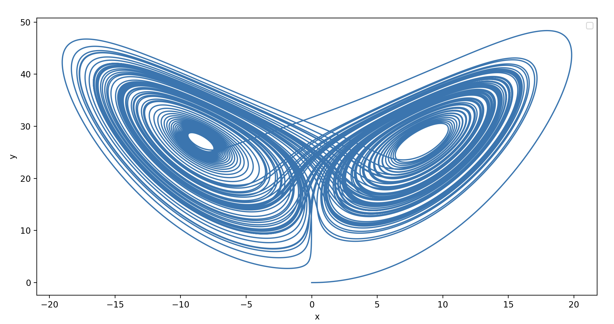

## Comparision of different ODE solver implementations' time consumption

Is Python slow for solving ODEs? A simple experiment to compare the time consumption of different ODE solver implementation solutions.

## Problem

To solve the lorenz system of ODEs with:

- Time span: (0, 100)
- Step size: 1e-5
- Initial values: (0.0, 1.0, 0.0)

## Solver implementation solutions

- **Pure Python**: RK4 written in Python
- **C library + Python callback funcition**: RK4 written in C++
- **Using Python to compile C library**: RK4 written in C++
- **Scipy**: Using `integrate.odeint`, it seems the solver is written in Fortran as `odepack` in behind. Which algorithm is used, is not clear. But it seems not a adaptive method.
- **C++ lib** : Just as reference

## Result

:no_entry_sign: Non-adaptive ODE solver with pure Python is **extremly slow**

:heavy_exclamation_mark: Adaptive ODE solver with pure Python is OK, but only for certain equations 

 :white_check_mark: Scipy invokes ODE solver written in Fortran, "pure" python can be very fast

:no_entry_sign: C++ & Python mixed programming would **not help much**, the huge amount of iteration and the unnecessary data exchange in memory still limits the performance

 :white_check_mark: Generating C lib via Python accelerates very much, but might only be a solution in certain circumstance, for example, if Python is used as glue language not only for solving ODEs.

:heavy_exclamation_mark: Pure hand-written C lib with RK4 is still slower than Scipy. Algorithm optimization matters a lot. 

| Impl. solutions                 | Solver time consumption | Runtime  |
| ------------------------------- | ----------------------- | -------- |
| **Pure Python (RK4)**           | 167.50 s                | 168.74 s |
| **C lib+Python Callback (RK4)** | 20.62 s                 | 25.60 s  |
| **Python compiles C lib (RK4)** | 0.74 s                  | 6.87 s   |
| **Scipy with Python (Unknown)** | 0.59 s                  | 0.61 s   |
| **C++ lib**                     | /                       | 0.72 s   |
| extra: pure Python (RKF)        | /                       | 3.49 s   |

